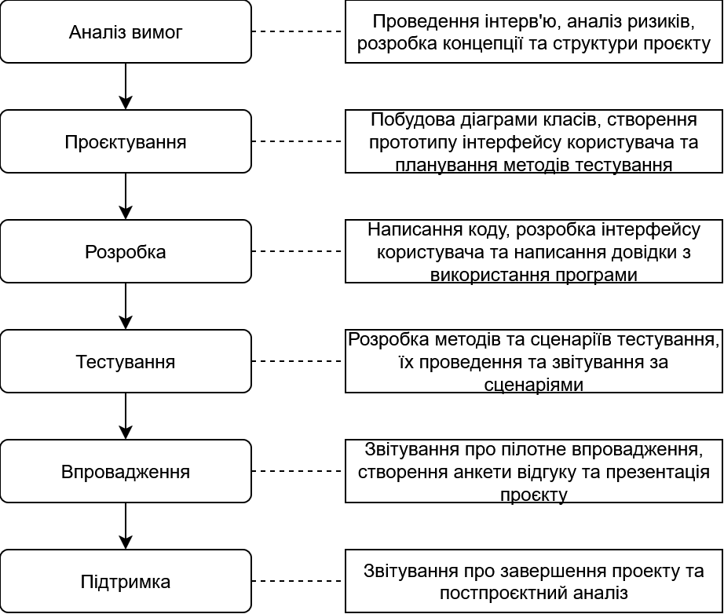

# Модель розробки

Проект: Розробити веб-застосунок для управління персональними завданнями (Task Manager)

Команда: Programists

## Водоспадна модель

## Модель життєвого циклу проекту

## Основні етапи життєвого циклу
Період розробки проєкту - 4 тижні, часові рамки етапів прогнозовані
### Аналіз вимог
Цей етап займає 15% часу. На ньому виконується проведення інтерв'ю, аналіз ризиків, розробка концепції та структури проєкту. Максимально активні рольові кластери - Program Management, Product Management.

### Проєктування
Цей етап займає 20% часу. Побудова діаграми класів, створення прототипу інтерфейсу користувача та планування методів тестування. Максимально активні рольові кластери - Development, User Experience, Test.

### Розробка
Цей етап займає 35% часу. Написання коду, розробка інтерфейсу користувача та написання довідки з використання програми. Максимально активні рольові кластери - Development.

### Тестування
Цей етап займає 15% часу. Розробка методів та сценаріїв тестування, їх проведення та звітування за сценаріями. Максимально активні рольові кластери - Test.

### Впровадженя
Цей етап займає 10% часу. Звітування про пілотне впровадження, створення анкети відгуку та презентація проєкту. Максимально активні рольові кластери - Release Management, Product Management.

### Підтримка
Цей етап займає 5% часу. Звітування про завершення проекту та постпроєктний аналіз. Максимально активні рольові кластери - Program Management.

---

- [x] *Левковська Марія*
- [x] *Єдалов Артем*

---
[:arrow_up: Повернутись до початку етапу](/docs/2.Planning/README.md)
